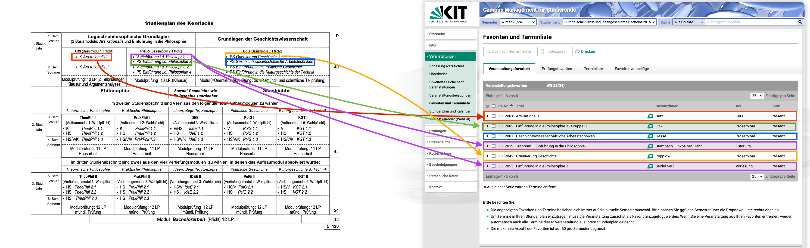
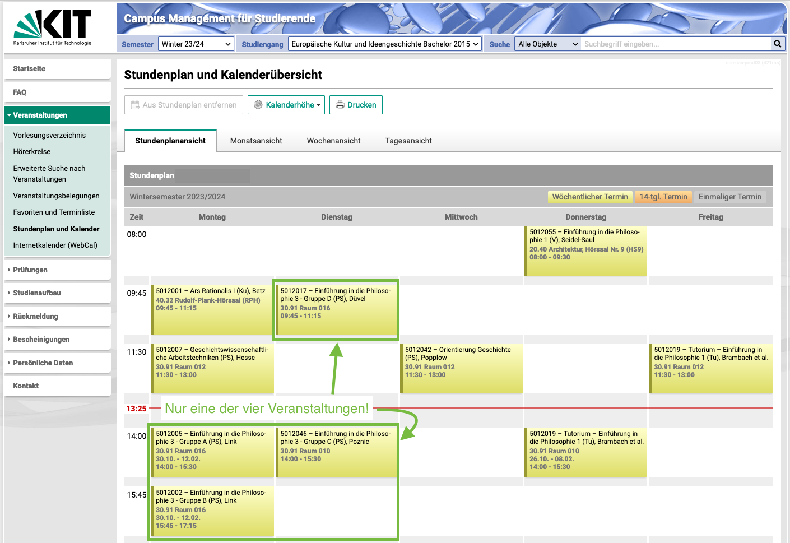
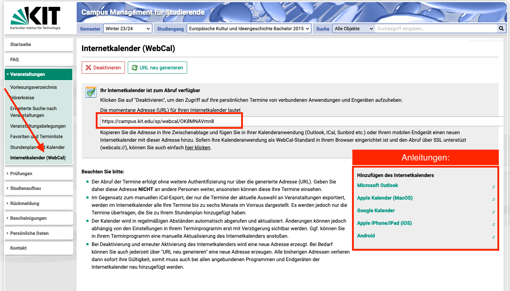
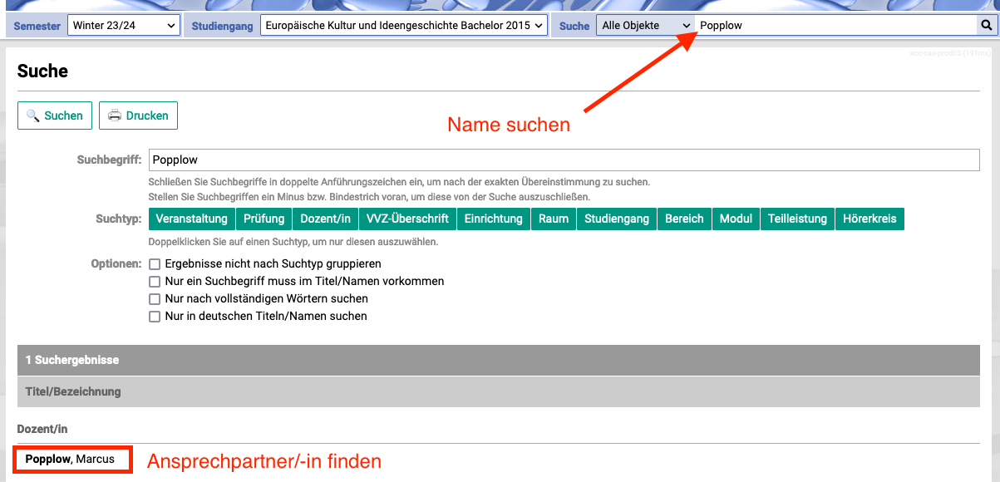
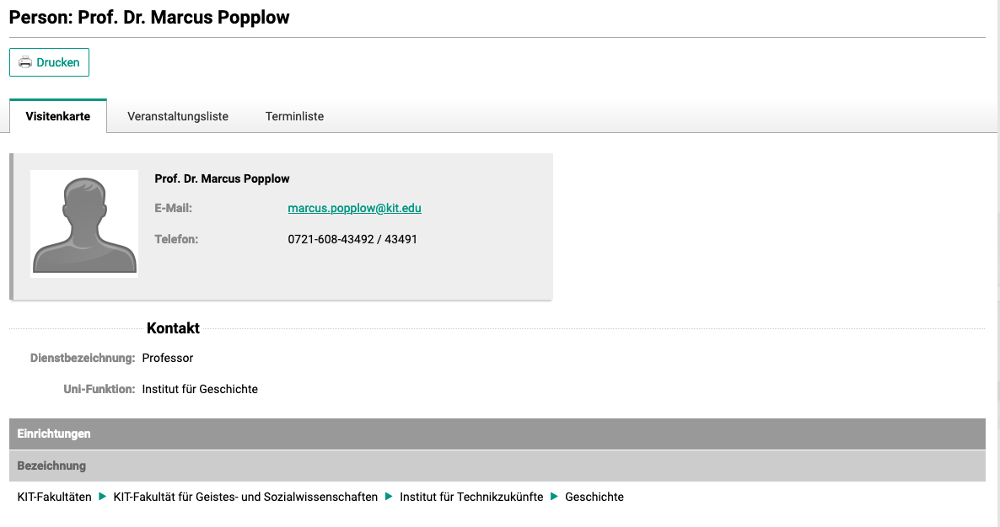
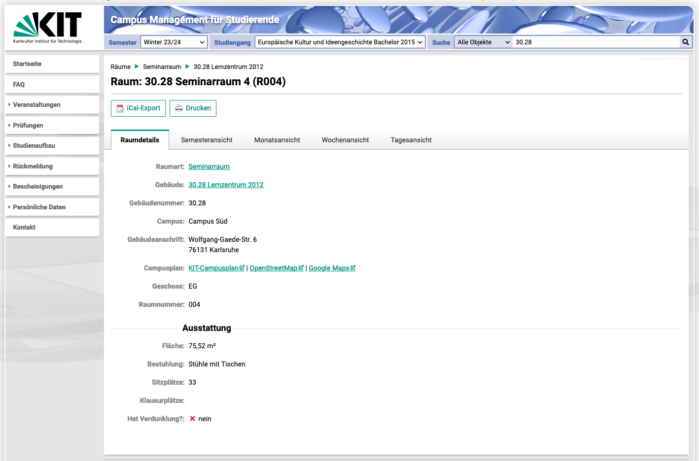
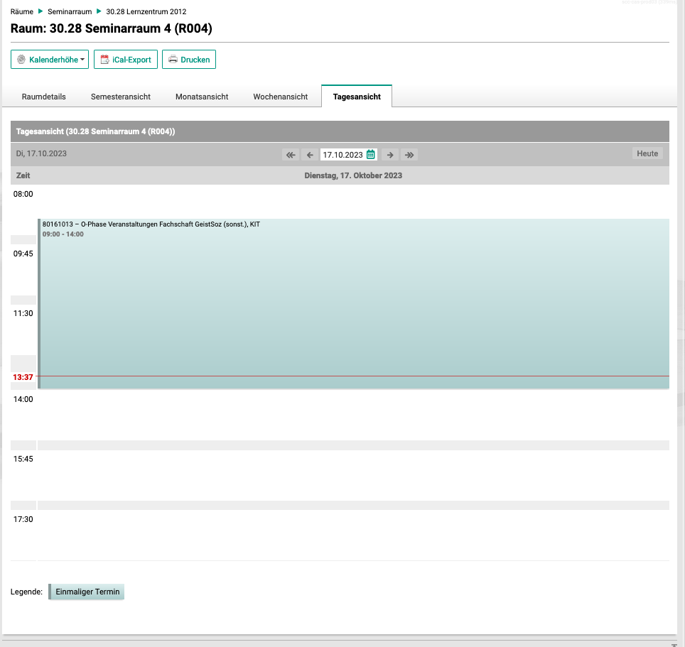
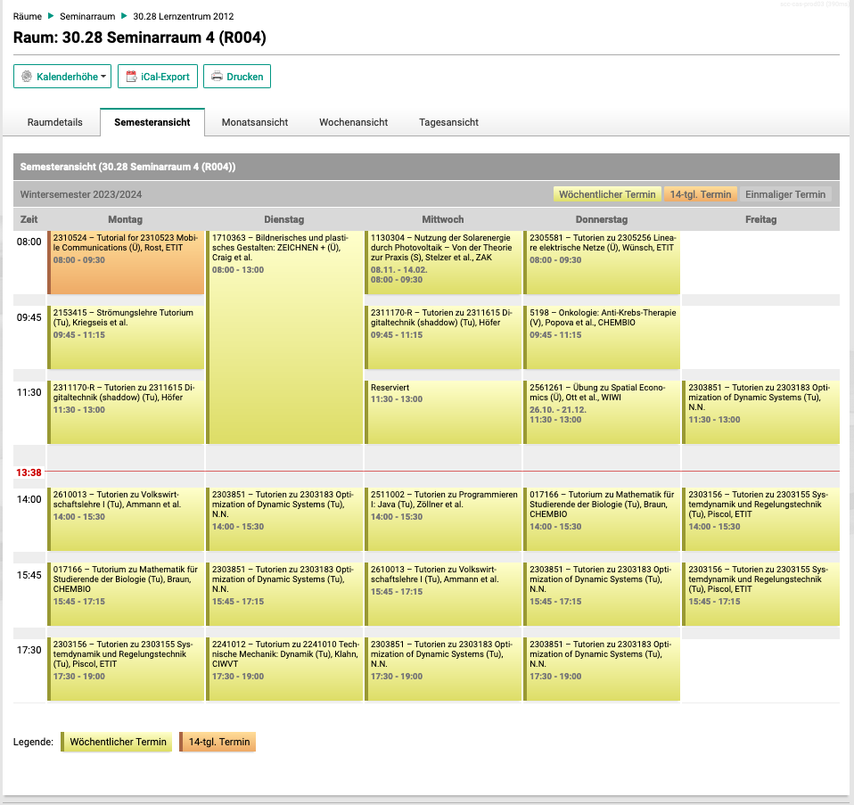
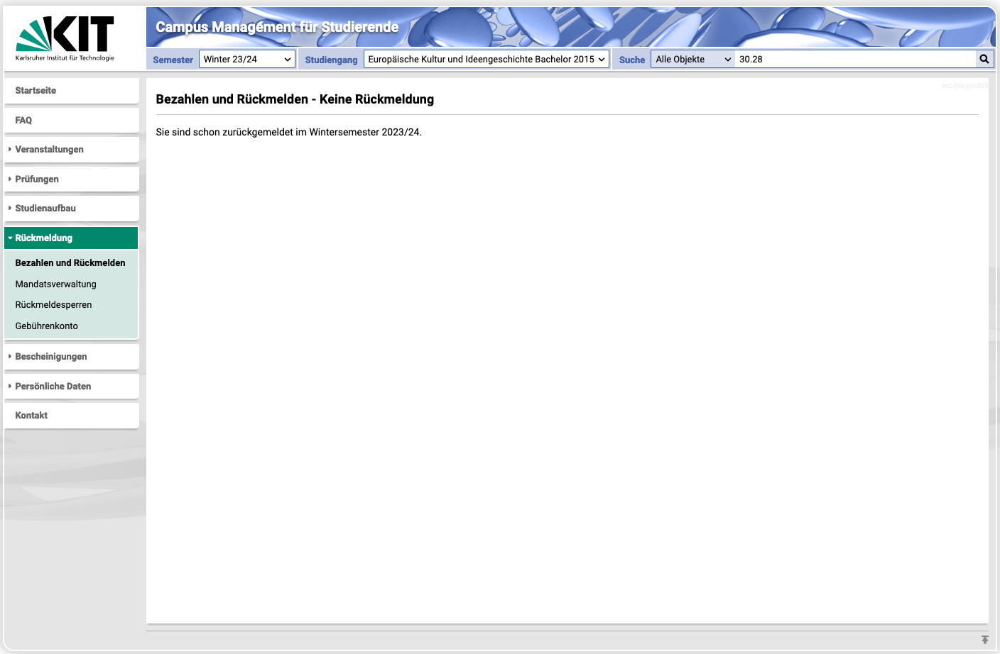

# #[[Campus Management System (CMS)]]
	- Abrufbar über [campus.studium.kit.edu](https://campus.studium.kit.edu)
	- ## Wozu?
		- ### Semesterplanung und #Stundenplan
		  id:: 652d1877-12fb-4341-9224-778140a13ed1
			- 
				- 
			- Option des Kalender-Exports bzw. -Abonnements
			  id:: 652d1c9f-6727-4525-9163-06d559176f4e
				- 
				- collapsed:: true
					-
		- ### Kontaktdaten finden
			- 
			- 
		- ### Raumbelegungen prüfen
			- Die Bib ist mal wieder zu voll?
			- In der vorlesungsfreien Zeit sind sämtliche Seminarräume in der Regel zum Lernen freigegeben. Auch nachmittags gibt es deutlich weniger Veranstaltungen und es spricht absolut nichts dagegen, einen freien Raum einfach so zu nutzen.
			- Im CMS nach Gebäudenummer suchen, Raum auswählen und mehr erfahren
				- 
				- **Tagesansicht vs. Semesteransicht**
					- Einmalige Termine wie der der Hauptfachberatung stehen natürlich nicht in der Semesteransicht
					- 
					- vgl.:
					- 
		- ### Rückmeldung
			- Über den Eintrag links findet man Informationen zur Rückmeldung.
			- Sich zurückzumelden heißt, den Semesterbeitrag zu überweisen. Die Fristen hierzu findet man unten über [Termine und Fristen](https://www.sle.kit.edu/imstudium/termine-fristen.php)
				- für das Sommersemester 15.01. – 15.02.
				- für das Wintersemester 01.07. – 15.08.
			- 
			- Wann die Rückmeldephase beginnt erfährt man per Mail - stetige Erinnerungen verpasst man zudem nicht über den [Fachschafts-Instagram-Kanal](https://www.instagram.com/fachschaftgeistsozkit/)
		- ### Prüfungsanmeldung
			- Links im Menü findet sich auf der Reiter für Prüfungsan- und abmeldungen.
			- Mehr rechtliche Rahmeninfos hierzu bitte dem #Modulhandbuch und der #SPO entnehmen
			- Allgemein wichtig jedoch:
				- Für sämtliche Veranstaltungen, die man in einem Semester auch eingetragen haben will, muss man angemeldet sein. Entsprechend braucht es hierzu auch die rechtzeitige Anmeldung. Da diese jedoch je nach (Neben-)Fach und Veranstaltungsform (etwa für Prüfungen später) verschiedene Fristen haben, kann man dazu keine generelle Aussage treffen. Vor Ende des Novembers ist jedoch immer ein guter Zeitpunkt im Wintersemester, im Sommersemester vor Ende Mai.
					- ==Tragt euch also bereits jetzt eine entsprechende Erinnerung ein oder fügt euch das folgende Ereignis im Kalender hinzu!==
						- [Wintersemester jährlich wiederholend](../assets/anmeldungen-prüfen-wintersemester-jährlich-wiederholend.ics)
						- [Sommersemester jährlich wiederholend](../assets/anmeldungen-prüfen-sommersemester-jährlich-wiederholend.ics)
- # #ILIAS
	- Abrufbar über [ilias.studium.kit.edu](https://ilias.studium.kit.edu)
	- ## Wozu?
		- Bereitstellung von Lehr- und Lerninhalten
		- Quasi jede Veranstaltung setzt eine Anmeldung voraus
		- Kommunikation von Terminen findet über Mailverteiler des ILIAS-Kurses statt
		- [Fachschafts-ILIAS-Kurs](https://ilias.studium.kit.edu/ilias.php?ref_id=1427548&cmdClass=ilrepositorygui&cmdNode=x1&baseClass=ilrepositorygui)
			- leider mäßig genutzt und aktuell
-
- # #[[SCC Self Service Portal]]
	- Abrufbar über [my.scc.kit.edu](https://my.scc.kit.edu)
	- ## Wozu?
		- Accountverwaltung
			- Passwortänderung
			- Mail-Alias und Weiterleitung deaktivieren
			  id:: 652d2867-f723-4ecd-af2a-1d79da6b063f
			- (De-)Pseudonymisierung für MS Teams
			  id:: 652d2870-e134-465e-9bf8-6c0a2f8d9dcc
			- Zwei-Faktor-Authentifizierung
			- Bild für KIT-Karte
-
- # #[[Sonstige praktische Seiten]]
  id:: 652d28b5-72f4-4c2b-a948-b110a0889123
	- ## Alles rund um IT
		- [Erstsemester Guide des SCC](https://www.scc.kit.edu/dienste/erstsemester.php#)
		- [Campuslizenzen für Software](https://www.scc.kit.edu/dienste/4786.php)
		- [KIT-VPN einrichten](https://www.scc.kit.edu/dienste/vpn.php)
	- ## Sonstiges
		- [KIT-Campusplan](https://www.kit.edu/campusplan/)
		- [Bib-Platzfinder](https://www.bibliothek.kit.edu/freie-lernplaetze.php)
		- [Mensa Speiseplan](https://www.sw-ka.de/de/hochschulgastronomie/speiseplan/mensa_adenauerring/)
			- [Mensa Autoload einrichten](https://www.sw-ka.de/de/hochschulgastronomie/bargeldloses_zahlsystem/)
				- Oder direkt zum »Studentenhaus« vor der Mensa und neben der Bib gehen, am Schalter nach Autoload fragen und einrichten lassen
		- [Fachschafts-Website](https://geistsoz.de)
			- leider mäßig aktuell
		- [Linienplan für das Bachelor-Studium](https://s.kit.edu/linienplan)
		  id:: 652d2948-ba10-42bf-8b11-19ab7e1becc6
		-
		- [Fakultätswebsite](https://geistsoz.kit.edu)
	- ## Backlinks
		- [[Softwareempfehlungen]]
		- ((652d2969-0ed6-49fe-a2d1-5b42c1b4f2a3))