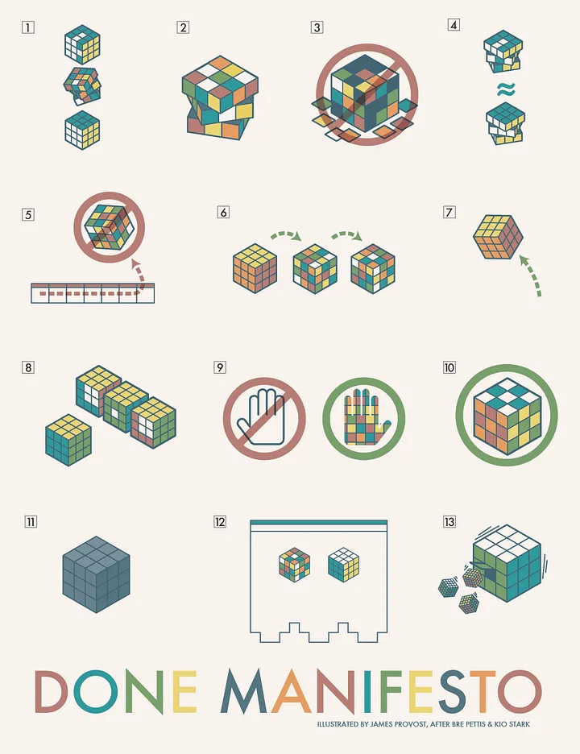

# Kurz und Knapp
	- Es ist die eigene Entscheidung, wieviel Zeit man für was aufbringt. Das kann eine ungewohnte Umstellung sein, bietet viele Freiheiten, aber gerade das erschwert es auch, sich in diesem neuen Alltag zurecht zu finden.
		- Nachbereitungen sind wichtig.
		- Das Studium ist zu 80% ein Selbststudium.
		- Lernen funktioniert ausschließlich, indem man selbst lernt.
			- Der Mensch kann einerseits nie aufhören zu lernen oder sich dem Lernen verweigern, aber was und wie man lernt und besonders: wie effektiv das Lernen am Ende ist, das sind bewusste Entscheidungen.
	- ==Sich Notizen zu machen, sie wiederzufinden, [Exzerpte](https://de.wikipedia.org/wiki/Exzerpt) zu erstellen und anschließend Texte zu schreiben ist *die* essenzielle Fähigkeit im geisteswissenschaftlichen Studium==
		- #Logseq
	- Man lernt einfach nie aus und oftmals gibt es klügere Wege, Ziele zu erreichen. Es lohnt sich immer, die eigenen Fähigkeiten und bisherigen Prozesse infrage zu stellen und nach neuen zu suchen.
		- Das Arbeiten zu lernen ist auch lernen. Dieses Meta-Lernen als ein Prozess von Selbstreflektion ist essenziell für den Erfolg im Studium, aber auch im Leben überhaupt.
	- Zukunftssichere Methoden, Systeme und Architekturen sind immer proprietären Einzellösungen zu bevorzugen.
		- Als Historiker/-in sollte man an der Archivierbarkeit von Inhalten ein gesundes und aufrichtiges Grundinteresse haben.
	- Laptop > Tablet
		- Mobile Betriebssysteme, gerade iPadOS, bleiben hinter Desktops zurück, wenn man produktiv recherchieren und schreiben möchte.
	- Backups von Materialien sind wichtig
		- Vielleicht will man eine Hausarbeit zu einer Veranstaltung schreiben oder sucht nochmals alte Materialien. Es ist gut, sie zu finden.
		- Entsprechend empfiehlt es sich nicht immer nur im ILIAS die Dateien anzuschauen sondern für jedes Semester einen Ordner und für jede Veranstaltung einen Unterordner usw. anzulegen.
			- Diese Ordner sollten ab und an woanders gespeichert werden - sonst ist es kein wirkliches Backup.
				- Es empfiehlt sich die 3-2-1-Regel:
					- 3 Dateien
					- auf 2 Systemen/Medien
					- 1 außer Haus
	- Lesezeichen sind hilfreich, wenn man Websiten sucht.
	- Es ist sinnvoll, einen Alltag und gute Gewohnheiten aufzubauen
		- Wenn man auch nur regelmäßig zwei Stunden an etwas arbeitet kann man Bemerkenswertes erreichen.
- # Allgemeine Erfahrungen
	- Es ist vollkommen egal, was Du glaubst, was Dozierende von Dir denken, wenn Du Fragen stellst. Anspruch an Dich selbst sollte stets sein, die Inhalte zu verstehen. Wenn Du glaubst, etwas nicht verstanden zu haben, frag nach.
	- Gute Regel: Nie glauben, der/die Einzige gewesen zu sein, der/die sich diese Frage stellt. - Egal bei was. Bei der Benutzung von Diensten, beim Lernen von Inhalten, …
	- Es lohnt sich: ((652d2867-f723-4ecd-af2a-1d79da6b063f))
		- ebenfalls: E-Mailclient direkt auf dem Gerät nutzen, keine Webmailclients.
- # Done-Manifesto
	- {{video https://www.youtube.com/watch?v=bJQj1uKtnus}}
	- ## The Cult of Done Manifesto
		- There are three states of being. Not knowing, action and completion.
		- Accept that everything is a draft. It helps to get it done.
		- There is no editing stage.
		- Pretending you know what you’re doing is almost the same as knowing what you are
		  doing, so just accept that you know what you’re doing even if you don’t 
		  and do it.
		- Banish procrastination. If you wait more than a week to get an idea done, abandon it.
		- The point of being done is not to finish but to get other things done.
		- Once you’re done you can throw it away.
		- ==Laugh at perfection. It’s boring and keeps you from being done.==
		- People without dirty hands are wrong. Doing something makes you right.
		- Failure counts as done. So do mistakes.
		- Destruction is a variant of done.
		- If you have an idea and publish it on the internet, that counts as a ghost of done.
		- Done is the engine of more.
	-
	- ## The Cult of Done Manifesto `Übersetzung (via ChatGPT-3.5)`
		- Es gibt drei Zustände des Seins: Nichtwissen, Handeln und Fertigstellen.
		- Akzeptiere, dass alles nur ein Entwurf ist. Das hilft dabei, es fertigzustellen.
		- Es gibt keine Bearbeitungsphase.
		- Vorgeben zu wissen, was man tut, ist fast dasselbe wie zu wissen, was man tut. Akzeptiere also, dass du weißt, was du tust, auch wenn du es nicht weißt, und tue es.
		- Verbannung des Aufschiebens. Wenn du mehr als eine Woche wartest, um eine Idee umzusetzen, gib sie auf.
		- Das Ziel des Fertigstellens besteht nicht darin, fertig zu sein, sondern andere Dinge zu erledigen.
		- Sobald du fertig bist, kannst du es wegwerfen.
		- Lache über Perfektion. Sie ist langweilig und hindert dich daran, fertig zu werden.
		- Menschen ohne schmutzige Hände liegen falsch. Etwas zu tun macht dich richtig.
		- Fehler zählen als erledigt. Genauso wie Missgeschicke.
		- Zerstörung ist eine Variante des Fertigstellens.
		- Wenn du eine Idee hast und sie im Internet veröffentlichst, zählt das als Geist des Fertigstellens.
		- Fertigstellen ist der Motor für mehr.
		-
	- ## Grafische Repräsentation
		- 
- # Praktische Seiten für das Studium
id:: 652d2969-0ed6-49fe-a2d1-5b42c1b4f2a3
	- Allgemein: Backlink zu ((652d28b5-72f4-4c2b-a948-b110a0889123))
	- Backlink zu ((652d2948-ba10-42bf-8b11-19ab7e1becc6))
	-
	- Backlink zu ((652c42dc-b4e7-40d6-9ae6-af7dd5baeadf))
	- ## Recherchen
		- Alle Bücher finden (und die nächste Bibliothek, die es hat)
			- [worldcat.org](https://worldcat.org)
		- Webarchiv - Versionen alter Seiten finden
			- [web.archive.org](https://web.archive.org)
		- Allgemeines akademisches Wörterbuch - als Alternative zu Wikipedia mit einschlägigen domänenspezifischen Wörterbüchern: [de-academic.com](https://de-academic.com)
		- ### Philosophie:
			- Für jeden Einstieg in ein Thema: [plato.stanford.edu](https://plato.stanford.edu)
			- Einige Publikationen: [philpapers.org](https://philpapers.org)