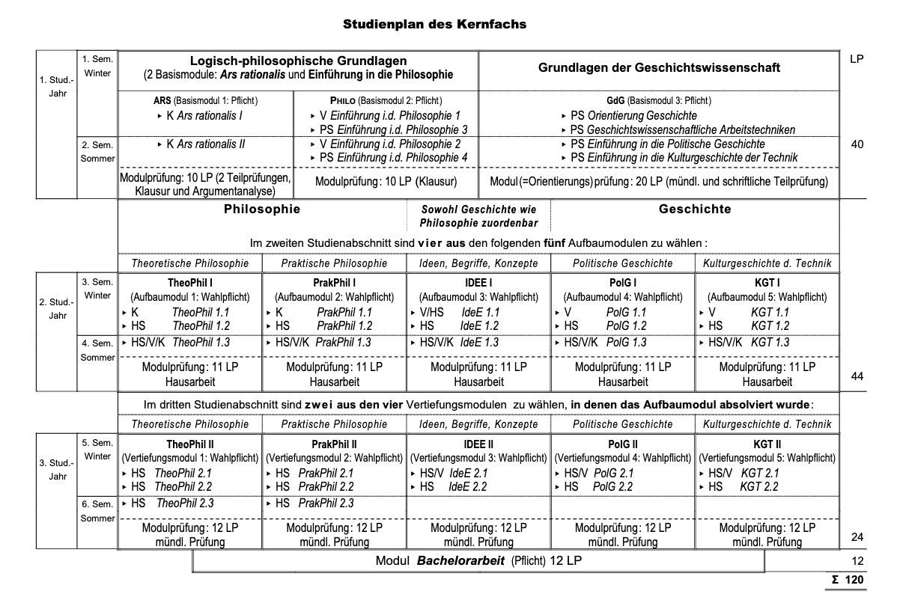

# Was ist das #Modulhandbuch?
- Das Modulhandbuch bietet eine Übersicht der im Studium absolvierbaren und wählbaren #Module. Es ist gewissermaßen ein Inhaltsverzeichnis und Register der aktuell im Studium angebotenen Inhalte und die Grundlage für das Erstellen eines Stundenplans. Zudem enthält es einige organisatorische und rechtliche Inhalte (verweist letztlich jedoch auch auf die #SPO) und erläutert den Ablauf des Studiums.
- # Wo finde ich das #Modulhandbuch?
- Semesterweise aktualisiert auf der Website der Fakultät für Geistes- und Sozialwissenschaften:
	- [geistsoz.kit.edu](https://geistsoz.kit.edu)
- Direkter Download für das [Wintersemster 2023/24](https://www.geistsoz.kit.edu/downloads/MHBs/MHB_BA_Euklid.pdf)
  id:: 652c12b1-6b08-4dc4-ac41-4ac7c4a69587
-
- # Wie ist das #Modulhandbuch aufgebaut?
- 
- -> Organisatorisches, Übersichten, Abläufe (Es empfiehlt sich, diese zu Beginn des Studiums und bei aufkommenden Fragen während des Studiums zu lesen.)
	- Zwar kann man immer andere fragen, doch vieles beantwortet sich auch, wenn man sich die Zeit nimmt, selbst zu recherchieren. Oftmals findet man direkt was man sucht und falls nicht, so anderes, was zukünftig wichtig sein könnte.
-
-
- ## #Studienplan
  id:: 652c42db-ea51-4106-811b-4b0c612ba85b
- Der Studienplan gibt vor, wie das Studium auszusehen hat und ist **die** Orientierung um den #Stundenplan zu erstellen
- Aufbau im Euklid Bachelor:
	- Grundlagenmodule im ersten Jahr
	  logseq.order-list-type:: number
	- Wählbare Module im zweiten Jahr
	  logseq.order-list-type:: number
	- Nochmals wählbare Module, jedoch aufbauend auf den ersten gewählten.
	  logseq.order-list-type:: number
- Begriffsbestimmungen aus dem Modulhandbuch:
	- > B a s i s m o d u l e stehen am Anfang eines Studienpfades: Sie können absolviert werden,
	  ohne dass zuvor andere Module absolviert sein müssten
	- > A u f b a u m o d u l e setzen voraus, dass mindestens ein Basismodul absolviert worden ist
	- > V e r t i e f u n g s m o d u l e schließen an die entsprechend benannten Aufbaumodule an
-
- Die Grundlagenmodule bieten keinerlei Wahlmöglichkeit.
- Für aufbauende Module findet man unter ihrem Eintrag im Modulhandbuch dazu passende Veranstaltungen, die frei gewählt werden können und entsprechend auch gleich viele Leistungspunkte geben. Des Öfteren können dieselben #Veranstaltungen in verschiedenen Modulen aufgeführt werden, diese sind dann jedoch nicht doppelt belegbar.
	- Aufbauende Module sind in der Regel erst nach Absolvierung vorangehender Module belegbar, d.h. insoweit muss dem #Studienplan gefolgt werden.
-
-
- ### #Kernfach
  id:: 652c42db-3a08-463a-9668-8b4b2160e637
	- 
-
- ### #Nebenfach
	- Zum Haupt- bzw. #Kernfach (das eine frei wählbare Gewichtung in Geschichte und Philosophie bietet) muss ein Nebenfach gewählt werden. Dieses kann ggf. auch im Nachhinein noch gewechselt werden, sollte aber mit dem ersten Semester feststehen.
	-
	- Die Nebenfachberatung findet am Mittwoch, dem 18.10. um 11h statt. Mehr Details zu den Räumen und etwaigen Änderungen im Ablaufplan zur O-Phase bzw. dem [Broadcast auf Telegram](https://t.me/+EK6qRoemwBQ1YTc6)
-
- #### Wählbare Fächer
	- Soziologie
	  logseq.order-list-type:: number
		- 
		  logseq.order-list-type:: number
	- Germanistik
	  logseq.order-list-type:: number
		- 
		  logseq.order-list-type:: number
	- Pädagogik
	  logseq.order-list-type:: number
		- 
		  logseq.order-list-type:: number
		- ` Wertende Anmerkung des Referenten: Mit Vorsicht zu genießen `
		  logseq.order-list-type:: number
	- Medientheorie und -praxis (MTP)
	  logseq.order-list-type:: number
		- 
		  logseq.order-list-type:: number
	- Kulturtheorie und -praxis (KTP)
	  logseq.order-list-type:: number
		- 
		  logseq.order-list-type:: number
	- Kunstgeschichte
	  logseq.order-list-type:: number
		- 
		  logseq.order-list-type:: number
	- Technikfolgenabschätzung (TA)
	  logseq.order-list-type:: number
		- 
		  logseq.order-list-type:: number
-
- Auch die Nebenfächer bieten einen #Studienplan an dem man sich orientieren sollte und der einen
-
- ## #Zusatzleistungen
	- #Schlüsselqualifikationen sind ergänzende, nicht in die Endnote miteinfließende jedoch im *Transcript of Records* aufgeführte Leistungen, die in der Regel zusätzliche Fähigkeiten und Kompetenzen vermitteln.
	- Mehr Infos im Modulhandbuch S. 9-10
- ## #Studienverlauf
- Die #Regelstudienzeit sind 6 #Semester, bei 180 Leistungspunkten insgesamt sollte man bei 30 #ECTS
- Der Bachelor besteht aus insgesamt 180 Leistungspunkten bzw. #ECTS wovon 120 auf das #Kernfach und 60 auf das #Nebenfach fallen
- Man kann auch problemlos länger studieren. Die #Maximalstudiendauer orientiert sich an der #Regelstudienzeit plus 5 Semester, also 11.
	- »Problemlos« natürlich in Abhängigkeit der finanziellen Situation -> #Studienfinanzierung
	-
- Es empfiehlt sich den #Studienplan von #Kernfach und #Nebenfach auszudrucken und bereits absolvierte Module zu markieren, wenn man das neue Semester plant und einen guten visuellen Überblick erhalten möchte.
- Die Pläne bieten auch eine direkte Übersicht zum Zeitpunkt im Studium, an welchem man die jeweiligen #Module absolvieren sollte. Man muss sich hierbei nicht daran halten, allerdings sind die #Module grob aufeinander abgestimmt, sodass man weniger #Stundenplan süberschneidungen hat.
	-