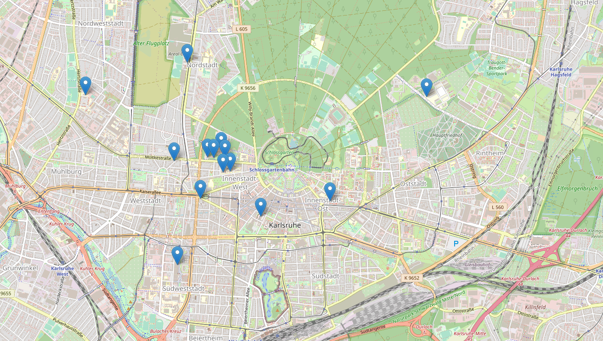
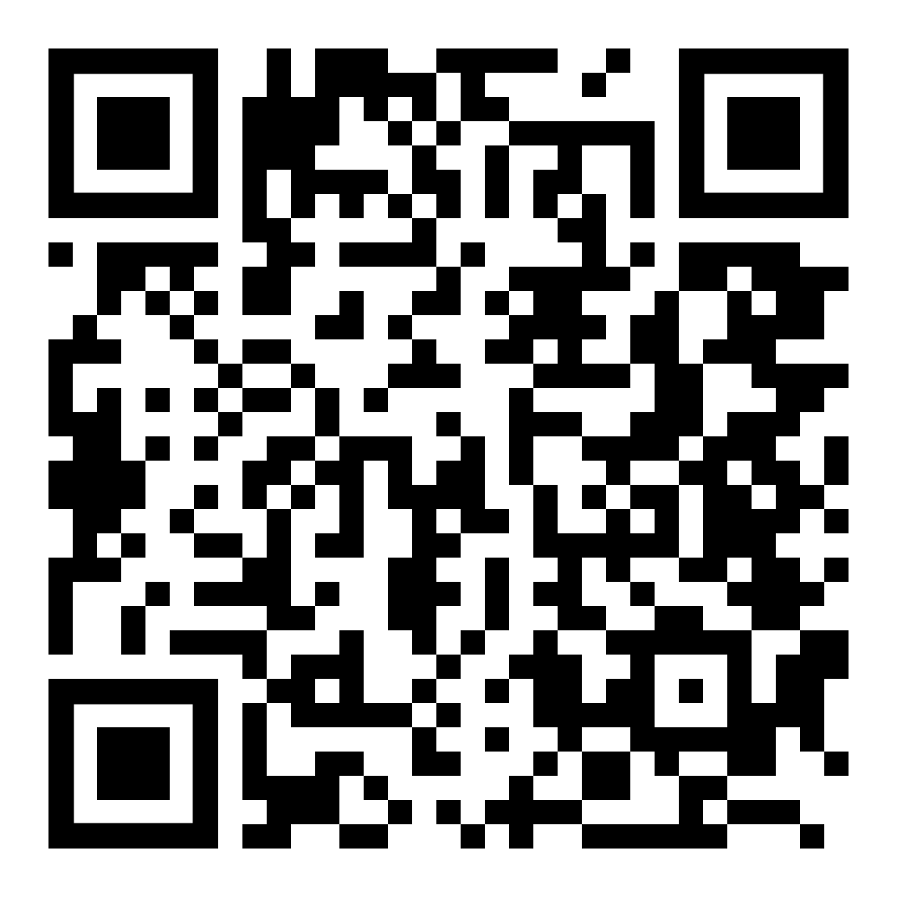

# Am besten (für diesen Vortrag)
	- Laptop
	- iPad / anderes Tablet
- # Internetzugang
	- ## [Allgemeine Anleitung des SCC](https://www.scc.kit.edu/dienste/wlan-konfiguration.php#Anker0)
	- ## KIT-WLAN
		- bietet Zugriff auf etwas mehr interne Dienste als eduroam, das ist aber selten relevant
	- ## eduroam
		- gibt es an nahezu jeder Uni / Hochschule, auch außerhalb Deutschlands
		- ==sinnvoller, sich als erstes einzurichten==
		- [Karte für Deutschland](https://map.eduroam.de)
			- Auch in Karlsruhe häufiger zu finden
			- {:height 299, :width 489}
		- [Weltweite Übersicht](https://eduroam.org/where/)
		- ### Einrichtung
			- <ukürzel>@kit.edu -> **Wichtig: kein @student.kit.edu** sondern ==*@kit.edu*==
			- Normales Uni-Passwort
			- Beim Zertifikat bestätigen auf ==`radius-wlan.scc.kit.edu`== achten
- # Materialien
	- ## [Link zu den Folien (als Website)](  https://conamara.eu/hauptfachberatung-euklid)
		- {:height 365, :width 342}
	- [Logseq-Ordner zum Download](https://github.com/pzauner/hauptfachberatung-euklid-logseq)
	  id:: 652d341c-8cbe-4148-8c99-128a5b814b4c
		- Vorab #Logseq installieren
			- [Download via Website](https://logseq.com/)
			- [Releases auf GitHub](https://github.com/logseq/logseq/releases)
	- #[[Aufzeichnung und Archiv]]
-
- # Fragen -> direkt stellen oder aufschreiben, damit man sie nicht vergisst