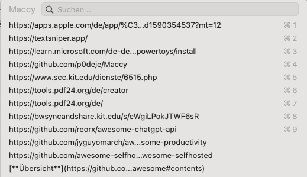
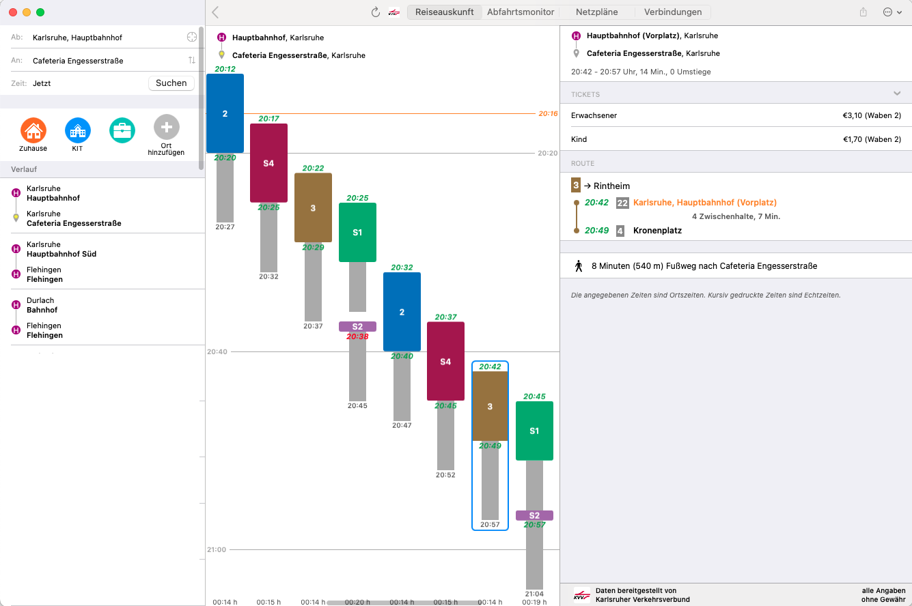

# Alternativen zu einer bestimmten Software finden
	- [AlternativeTo.net](https://alternativeto.net)
		- Mit Filtern für Betriebssystem, Bezahlvarianten, Open Source, usw.
-
- # #Plattformübergreifend
	- ## #Browser
		- Firefox
			- Plugins:
				- Cookie AutoDelete
				- Nervenschoner
				- SponsorBlock für YouTube
				- uBlock Origin
				- Zotero Connector
				- ClearURLs (entfernt utm-Referrer von Links)
		- wenn schon auf Chromium basierend: [Vivaldi](https://vivaldi.com/)
	- ## #Notizen
		- ((652c1166-d686-4451-b852-221c9de48c1a))
		- [Obsidian](https://obsidian.md)
		  id:: 652c3868-065b-40d2-ab92-f5521563a84f
			- In wenigen Bereichen besser als Logseq, aber nicht so umfangreich und geeignet für das Studieren
				- Mit Plugins ähnlich erweiterbar
				- Hat auch eine Graphenübersicht
				- Ist nicht Open Source
				- Das Programm für Leute die noch nicht Logseq nutzen
			-
		- ### #Hausarbeiten
			- [Scrivener](https://www.literatureandlatte.com/scrivener/overview)
			- [Overleaf](https://de.overleaf.com/)
				- Kostenlos für Studis
				- Wenn man schon in LaTeX schreibt, dann doch bitte nicht mit der TeX-Suite auf dem eigenen Rechner und dem Krampf rund um Installationen
				- tippst du noch oder setzt du schon?
				- Man wirkt einfach dreimal so cool (in der eigenen Vorstellung)
				- tbh: Es sieht aber auch einfach cleaner aus.
					- vgl: [Hausarbeit-Politische-Geschichte-Patrick_Zauner-Radikalenerlass.pdf](https://github.com/pzauner/hauptfachberatung-euklid-logseq/blob/main/assets/Hausarbeit-Politische-Geschichte-Patrick_Zauner-Radikalenerlass_1697395970066_0.pdf)
				- {:height 358, :width 658}
			- LaTeX-Nachfolger
				- [Typst](https://typst.app/)
				- [Curvenote](https://curvenote.com/)
			- ((652c3868-065b-40d2-ab92-f5521563a84f))
			- ((652c1166-d686-4451-b852-221c9de48c1a))
				- Nicht ganz so geeignet um die Hausarbeit auch als solche zu exportieren, aber erstklassig um sämtliche Informationen bis dahin zu sammeln und verknüpfen
			- Word (eigentlich nur gut wegen der Zotero-Integration)
			-
	- ## #Aufgabenmanagement
		- ` Auf Abomodelle gehe ich nicht ein `
		- [Todo.txt](http://todotxt.org/)
			- Eine Textdatei, ein einfaches Schema, alles andere ist sekundär. Ein Notizbuch hat es doch bisher auch getan, wozu braucht man also ein bloatet Kanbanboard in einer 1GB großen Software wie Teams? Genau.
			- Kein Schnickschnack, einfach zu syncen, funktioniert auch ohne irgendwas drumrum
		- Simpel in der Cloud deiner Wahl?
		- Via CalDav synchronisiert: z.B. [Tasks in der Nextcloud](https://apps.nextcloud.com/apps/tasks)
			- https://raw.githubusercontent.com/nextcloud/tasks/master/screenshots/tasks-1.png
			- Abonnierbar mit diversen Erinnerungsapps
			- [Deck in Nextcloud](https://apps.nextcloud.com/apps/deck)
				- 
				- Nextcloud der Uni: BWSyncandShare
					- Nutzbar via [BWSyncAndShare](https://bwsyncandshare.kit.edu)
						- 50GB for free während des Studiums
		- ((652c1166-d686-4451-b852-221c9de48c1a))
			- (kann einfach alles)
			- mit der 5$ im Monat Spende auch auf Mobilgeräten dazu zu gebrauchen (sowohl unter Android als auch iOS kann ich nur davon abraten mit git synchronisieren zu wollen)
		- [Things](https://apps.apple.com/de/app/things-3/id904237743)
			- Apple only
			- bisschen teuer auf dem Mac, aber ansonsten für 10€ ein guter Einmalkauf auf dem iPhone und kein Abomodell
		-
	- ## #Passwortmanagement
		- [KeePass(XC)](https://keepassxc.org/)
		- [Bitwarden](https://bitwarden.com)
			- gehostet 10$ im Jahr für Premiumfunktionen (eigentlich nur Zwei-Faktor-Authentifikation)
			- kostenlos zum selbst hosten
			- synchronisiert besser als KeePass, sieht besser aus und funktioniert zuverlässiger auf mehr Websiten
		- [1Password](https://1password.com)
			- gut, featurereich und schön anzusehen
			- Kostet allerdings monatlich Geld und zwar deutlich mehr als Bitwarden.
		-
		- ==Nutz ansonsten was auch immer dir dein Betriebssystem direkt gibt, aber verwende nicht überall dieselben Passwörter!==
		-
		-
	- ## #Lesezeichenmanagement
	  collapsed:: true
		- Geteilte Lesezeichen im Browser
		- [Omnivore](https://omnivore.app/)
			- https://omnivore.app/static/landing/landingPage-feature@1x.png
			- »Frisst« alles.
			- Open Source, überall verfügbar
			- Read Later Funktionalität
		- [Pocket](https://getpocket.com)
		- [Archivebox](https://archivebox.io/)
			- Eigenes web.archive.com
			- Du studierst Geschichte, dich sollte Archivverwaltung und Mirroring interessieren.
				-
		- [Zotero](https://Zotero.org)
			- Mehr als bloß Lesezeichenmanagement
			- Verwaltet deine Literatur für Hausarbeiten, gibt dir die Möglichkeiten, direkt Fußnoten einzufügen, Literaturverzeichnisse zu erstellen, PDFs zu markieren, usw.
			- 
			-
			-
		-
	- ## #Mails
		-
-
- # #Logseq
  id:: 652c1166-d686-4451-b852-221c9de48c1a
	- [Dokumentation](https://docs.logseq.com/)
	  id:: 652c266e-e50d-4f40-b461-895699994193
	- [Eine (es gibt einige) Tutorial-Playlist]({{video https://www.youtube.com/playlist?list=PLwpUQg3DhPIrx0mTZNjg3u5WdYyG0a0m4}})
	- [Forum](https://discuss.logseq.com/)
	- Kann alles, ist Open Source und einfach Perfektion.
	- Einige Features:
		- Markdown-Syntax
		- ToDo-Listen
		- Notizen mit Verschlagwortung und maximaler Interlinkbarkeit
		- Erweiterbar mit Plugins
		- Zotero Integration
		- Direkt präsentieren anstatt separat Folien zu erstellen
		- Plain Text -> Einfach zukunftssicher und gut zu synchronisieren bzw. mit git gut geeignet für  Versionshistorie
			- {{video https://www.youtube.com/watch?v=WgV6M1LyfNY}}
		-
-
- # Für #macOS
	- [Maccy](https://github.com/p0deje/Maccy)
		- Bietet die Option sämtliche kopierten Inhalte direkt wieder einzufügen und mehrere Inhalte zu kopieren
		- 
	- [TextSniper](https://textsniper.app/)
		- 
		- Text vom Bildschirm direkt per OCR in die Zwischenablage kopieren
	- [ÖPNV Navigator](https://apps.apple.com/de/app/%C3%B6pnv-navigator-desktop/id1590354537?mt=12)
		- Von einem KIT-Studenten
		- für iOS kostenlos
		- für Android gibt es eine vergleichbare App: Öffi
		- einfach das Beste.
		- 
	- [AlDente](https://apphousekitchen.com/de/)
		- Ladezustand für mehr Akkulanglebigkeit begrenzen - Wieso sollte der Rechner immer auf 100% geladen sein, wenn ich für Stunden in der Bib sitze und ohnehin am Strom bin?
	- [BetterTouchTool](https://folivora.ai/)
		- 
		- Mittelklick auf dem Trackpad (ok, eher ein Argument gegen macOS als für BTT, aber es geht!)
		- Custom Widgets auf der Touchbar um dem Dreck wenigstens irgendwas Gutes abzugewinnen
		- GPT-Integration:
			- Shortcuts um ausgewählten Text direkt an die ChatGPT-API von OpenAI zu senden
			- Direkt Sätze paraphrasieren, ähnliche Worte finden, Dinge erklären oder zusammenfassen lassen.
		-
		-
- # Für #Windows
	- [pdf-tools](https://tools.pdf24.org/de/creator) (auch [vom SCC empfohlen](https://www.scc.kit.edu/dienste/6515.php))
	- [Windows Power Toys](https://learn.microsoft.com/de-de/windows/powertoys/install)
	- [Windows Debloat Tools](https://github.com/LeDragoX/Win-Debloat-Tools)
		- gibt verschiedene, aber ist ein guter Anfang
	-
-
-
- # #[[Awesome Listen]]
  id:: 652c42dc-b4e7-40d6-9ae6-af7dd5baeadf
	- Von Connoisseuren guter Software und Arbeitsabläufen erstellte Listen zu bestimmten Themen und Kategorien
	-
	- Eine kleine Auswahl:
		- [**Wichtigste Liste für das Studium: Produktivität**](https://github.com/jyguyomarch/awesome-productivity)
		-
		- [**Übersicht und OG Awesome**](https://github.com/sindresorhus/awesome#contents)
		- [**Selfhosting**](https://github.com/awesome-selfhosted/awesome-selfhosted)
		-
		- [**ChatGPT-API**](https://github.com/reorx/awesome-chatgpt-api)
-