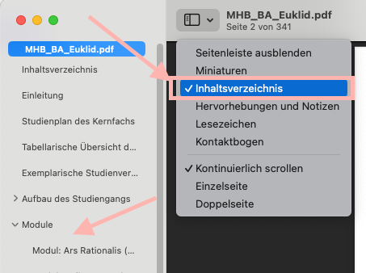
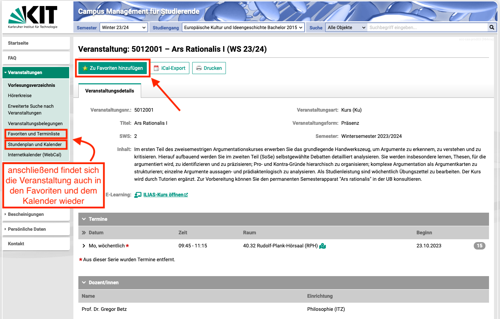
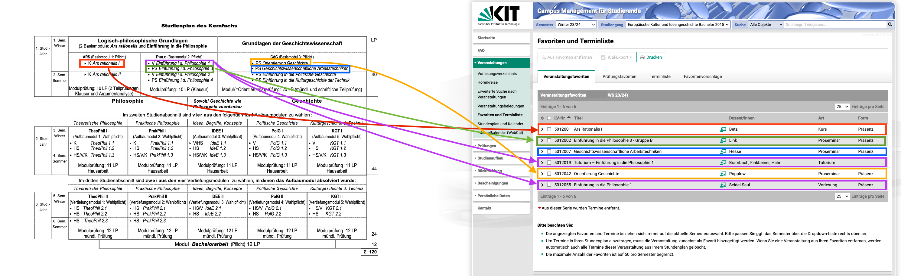

# Wie erstelle ich meinen #Stundenplan?
	- 1. #Studienplan im #Modulhandbuch anschauen
		- ((652c42db-3a08-463a-9668-8b4b2160e637))
		- 
	- 2. Teilleistung(en) heraussuchen
		- 
	- 3. Jede Teilleistung über Modul im #Modulhandbuch nachschlagen
		- 
		- 
		- ==Alternativ: Einfach in der PDF nach Modulnamen suchen==
			- `Strg oder CMD + F`
	- 4. Veranstaltungen im #[[Campus Management System (CMS)]] aufrufen
		- 
		- Entweder per Klick auf die Veranstaltung im #Modulhandbuch
		- Oder per Suche im #[[Campus Management System (CMS)]] nach Teilleistungsnummer
	- 5. Veranstaltungen im #[[Campus Management System (CMS)]] zu den Favoriten hinzufügen
		- 
	- 6. Anmeldung im ILIAS
		- Ggf. vorher oben rechts anmelden
		- Wenn keine Anmeldung möglich ist kurz vor Semesterbeginn nochmal prüfen
			- 
		- Ansonsten: Anmelden
			- 
				-
	- 7. ((652d1c9f-6727-4525-9163-06d559176f4e))
-
- # Stundenplan des Kernfachs für das Wintersemester 2023/24
	- 
	- 
	- ## Links zu den Veranstaltungen im CMS
		- ### Logisch-Philosophische Grundlagen
			- #### Ars Rationalis
				- [Ars Rationalis I](https://campus.studium.kit.edu/ev/pcd87mXsRza3SbVCNWJDyQ/de)
			- #### Philosophie
				- Einführung in die Philosophie 1
					- [Vorlesung](https://campus.studium.kit.edu/ev/LTpNNLDZSpW8vZ6kZ2tjBw/de)
					- [Tutorium](https://campus.studium.kit.edu/ev/RIrAT1rASsGItUO8dxnp9A/de)
				- Einführung in die Philosophie 3
					- [Gruppe A](https://campus.studium.kit.edu/ev/fmyg47G1SASI6OYFk_P7BQ/de)
					- [Gruppe B](https://campus.studium.kit.edu/ev/Ywzv2PZeQ522aZf9lJU9YA/de)
					- [Gruppe C](https://campus.studium.kit.edu/ev/L8nrN7XlRO-cWcVkxjSEDg/de)
					- [Gruppe D](https://campus.studium.kit.edu/ev/QqGNq3aSQaitQhlQNL0MhA/de)
			- ### Grundlagen der Geschichtswissenschaft
				- #### [Orientierung Geschichte](https://campus.studium.kit.edu/ev/OLbIcxUUQBu7RZLfcGZKMg/de)
				- #### [Geschichtswissenschatliche Arbeitstechniken](https://campus.studium.kit.edu/ev/1tGP4vzURDyYxGEkxVnI_A/de)