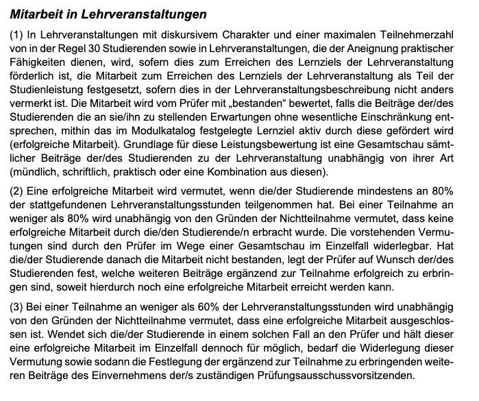

# #Vorlesungen
	- Keine Anwesenheitspflicht
	- Unidirektionale Auslegung: Dozent/-in spricht, wenig(er) Möglichkeiten für Fragen / interaktiven Austausch während der Veranstaltungen+
	- > In Vorlesungen präsentieren die Lehrkräfte ihren Hörerinnen und Hörern ein Themen-
	  gebiet im Überblick. Sie geben Anregungen zur eigenen Lektüre und Hinweise zur Vorberei-
	  tung auf die Modulprüfung in dem Modul, dem sie zugeordnet sind.
	-
- # #Kurse
	- Interaktivere #Vorlesungen
-
- # #Übungen
	- > Übungen, die der Vertiefung und Anwendung der in einer Vorlesung präsentierten
	  Wissensbestände dienen, können auch als Tutorien oder im Rahmen des Mentorenprogramms für Studierende im ersten Fachsemester von Akademischen Tutoren oder Tutorinnen durchgeführt werden.
- # #Seminare
	- > Seminare im 1. Studienjahr (bzw. in den Basismodulen) heißen Proseminare, solche im
	  2. und 3. Studienjahr (bzw. in den Aufbau- und Vertiefungsmodulen) heißen Hauptseminare.
	  Für diese Lehrform ist die aktive Beteiligung der Studierenden, vor allem in Gestalt von
	  Referaten und Präsentationen, wesentlich (s. u. Anwesenheitspflicht)
	- #Anwesenheitspflicht
		- 
-
- Die Zitate entstammen aus dem #Modulhandbuch des Wintersemesters 23/24 -> ((652c12b1-6b08-4dc4-ac41-4ac7c4a69587))